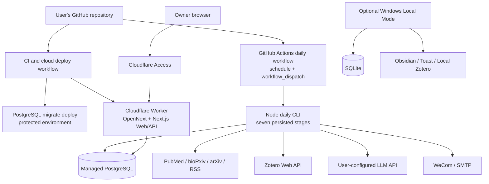

# Cloud Mode A architecture

> **Classification: historical design/reference material.** Dated implementation and acceptance statements below are not current project state. See `docs/ARCHITECTURE.md` and `docs/PROJECT_STATE.md`.

> **Local portions retired (2026-09-19):** DPO-011 supersedes this design's Local Mode default/support, SQLite parity, Windows scheduling, and Obsidian filesystem recommendations. They are abandoned plans, not fallback procedures. The supported runtime is GitHub-hosted jobs + external cloud services; see [current architecture](ARCHITECTURE.md#cloud-execution-boundary). The text below is preserved as history.

Implementation update (2026-07-27): PR 4 now includes the OpenNext Worker runtime, Neon adapter client, capability/request guards, health split, and deployment runbook. Real GitHub/Neon/Cloudflare account acceptance is still pending credentials.

Status: approved architecture; PR 1–PR 3 contracts are implemented. Worker deployment remains future PR 4 scope.

## Decisions made by this design

- Preserve Windows Local Mode as the default when `DEPLOYMENT_MODE` is absent.
- Add explicit `DEPLOYMENT_MODE=cloud`; invalid combinations fail closed.
- Run the daily pipeline in a standard Node process on GitHub Actions, directly connected to managed PostgreSQL.
- Deploy the existing Next.js UI and short interactive APIs to Cloudflare Workers through OpenNext.
- Keep SQLite and PostgreSQL schemas/migrations separate while sharing the application domain and HTTP DTOs.
- Force Zotero Web API in Cloud Mode.
- Keep Obsidian filesystem sync, Windows Task Scheduler, and Toast Local-only.
- Protect the production `workers.dev` Worker with Cloudflare Access, validate its JWT again in the Worker, and retain application request-integrity/capability guards.
- Do not introduce D1, Workflows, Queues, SaaS tenancy, or an Obsidian plugin in this migration.

## Approved instance inputs (2026-07-26)

- The first personal instance uses Neon PostgreSQL in AWS `eu-central-1` (Frankfurt). Region is a deployment choice, never an application default; deployment guidance tells each user to choose a nearby Neon region.
- The first Cloud database starts empty after the PostgreSQL migration history is deployed. Existing SQLite remains untouched; Zotero data and profile snapshots are rebuilt through normal synchronization. Historical recommendation/feedback import remains an optional later maintenance interface.
- The first release uses `daily-paper.<account-subdomain>.workers.dev` with preview URLs disabled. Cloudflare Access uses an instance-owner email allowlist configured outside the repository. Dashboard and interactive APIs are protected; no public-domain or `Everyone` allow policy is permitted. Headless callers use a separate service token if a future API call needs one.
- The template workflow uses `Asia/Shanghai` at 08:15 and retains `workflow_dispatch` with a required, strictly validated UTC `runDate`. Each user may edit `.github/workflows/daily.yml`; cron and timezone are not business-code settings.

The owner's actual login address, Neon credentials, database URL, and Access policy values are personal deployment data and must not be committed.

## Target topology



The PostgreSQL database is the Cloud Mode source of truth. GitHub Actions writes job results; the Worker reads feeds/status and writes interactive feedback/configuration supported in Cloud Mode. The Worker does not proxy a request to a user's powered-off PC.

## Why Actions executes directly

| Criterion | A. Actions runs Node job and connects to PostgreSQL | B. Actions calls Worker daily API |
|---|---|---|
| Fits current pipeline | Good after adding a CLI entry | Current route runs all seven stages synchronously |
| Runtime limit | Normal hosted runner with explicit workflow timeout | Worker request depends on client connection and Worker CPU/subrequest limits |
| Node/Prisma compatibility | Standard Node PostgreSQL client | Requires every job dependency to be Worker-compatible |
| Secret placement | Job secrets stay in GitHub environment | Worker receives Zotero, LLM, notification, and DB secrets |
| Failure logs | Native Actions step/job logs | Split between Actions and Worker logs |
| Attack surface | No public job endpoint required | High-cost public endpoint needs service auth and abuse controls |
| Recommendation | **Selected** | Rejected for first release |

Cloudflare documents a 15-minute wall-time limit for Cron and CPU limits for Workers, while HTTP work remains tied to an active request and post-response work is short-lived: [Workers limits](https://developers.cloudflare.com/workers/platform/limits/). Even where network waiting does not consume CPU, this pipeline is the wrong responsibility for an interactive web request.

## GitHub Actions daily workflow contract

Implemented in `.github/workflows/daily.yml`:

```text
events:
  schedule: fixed non-top-of-hour UTC/IANA schedule committed to default branch
  workflow_dispatch:
    runDate: required YYYY-MM-DD for manual dispatch
    sources: optional validated choice/list

permissions:
  workflow: contents: read
  preflight job: contents: read plus actions: read

concurrency:
  group: daily-paper-cloud-production-<businessDate>
  cancel-in-progress: false
  queue: max (up to 100 pending runs)

job:
  runs-on: ubuntu-latest
  environment: production
  timeout-minutes: measured upper bound plus margin
  steps:
    checkout pinned major/SHA policy
    setup Node 22 with npm cache
    npm ci
    run event/date/branch/active-run preflight without production secrets
    enter the production environment only after preflight accepts the run
    validate and generate the PostgreSQL Prisma client
    prisma migrate deploy using the independent PostgreSQL history
    run direct daily CLI with validated runDate
    send job-side notifications when a settled result exists
    emit non-secret status summary
```

`schedule` and `workflow_dispatch` only execute from the default branch. Scheduled runs can be delayed, especially at the top of the hour, and inactive public repositories can have schedules disabled. These are platform properties, not application failures: [GitHub workflow events](https://docs.github.com/en/actions/reference/workflows-and-actions/events-that-trigger-workflows).

The first Cloud Mode slice starts from an empty Neon database and explicitly runs `prisma migrate deploy` before the daily CLI. It uses only `prisma/postgresql/migrations/**` and never changes Local Mode SQLite. A later Worker deploy workflow must coordinate compatible migrations instead of adding another migration history.

The template schedule is 08:15 in `Asia/Shanghai` (`cron: "15 8 * * *"` with an IANA `timezone`). Users edit both fields in their own workflow. See `docs/cloud-mode-a-github-actions.md` for setup and retry instructions.

Direct database execution deliberately expands the GitHub production environment's secret scope. It is still selected for Mode A because the current pipeline is a synchronous standard-Node operation and this phase explicitly excludes the durable queue/worker needed for a safe `202 + job id` trigger. A protected Worker trigger becomes preferable only after such a background execution plane exists; calling the current synchronous route merely moves the timeout boundary and duplicates job secrets in the Worker. Mitigations for the selected design are a protected environment, least-privilege runtime database role, pinned actions, explicit permissions, no pull-request secret exposure, database lease/fencing, and audited non-secret output.

### Outcome policy

| Pipeline result | Actions conclusion | Notification | Rerun behavior |
|---|---|---|---|
| `complete` | success | normal | request key returns already succeeded |
| `already_succeeded` | success | optional/no duplicate | no duplicate generation |
| settled `partial`, `retryable=false` | success with warning | partial | explicit manual retry only after policy change |
| retryable `partial` | failure | partial/failure | rerun resumes failed stage |
| `failed` | failure | failure fallback | rerun after persisted failure |
| `already_running` | failure/attention | none | wait or use stale-run recovery; never create a duplicate |

The CLI must return a machine-readable result and map it to an exit code without printing credentials or raw provider payloads.

The workflow timeout is not a substitute for application budgeting. The CLI must know its deadline, stop scheduling new provider calls before runner termination, and persist a resumable partial stage. LLM concurrency, candidate limits, retries, and maximum `Retry-After` must be included in the budget calculation. Provider POST retries should use a supported idempotency key where the chosen LLM API offers one; otherwise the run records the duplicate-charge risk and avoids blind retry after an ambiguous response.

## Deployment mode and capability contract

| Setting/capability | Local | Cloud |
|---|---|---|
| `DEPLOYMENT_MODE` | absent or `local` | explicit `cloud` |
| database URL | `file:` only | `postgresql:`/`postgres:` only |
| Prisma history | `prisma/migrations` | `prisma/postgresql/migrations` |
| Zotero transport | auto/local/web | web only |
| daily execution | Windows scheduler/API | direct Actions CLI |
| Obsidian filesystem | optional | hard-disabled |
| desktop toast | optional | hard-disabled |
| email/WeCom | scheduler-side | Actions job-side |
| daily API trigger | existing local behavior | disabled; use workflow dispatch |
| profile refresh | local UI/scheduler | explicit protected job; not automatic in first cloud slice |

Cloud capability checks must live below the UI. A hidden button is not a security or runtime boundary.

## Database architecture

### Provider histories

```text
SQLite Local Mode                    PostgreSQL Cloud Mode
prisma/schema.prisma                 prisma/postgresql/schema.prisma
prisma/migrations/**                 prisma/postgresql/migrations/**
prisma/dev.db (ignored)              managed PostgreSQL (external)
```

The logical data model remains aligned. Provider-native migrations, JSON defaults, enum representation, and generated-client runtime options may differ. CI validates both schemas and applies each history to a disposable database. A parity check documents and limits intentional divergence.

### Client lifecycle

- Local Next/Node may retain a process-level SQLite client.
- Actions uses a Node PostgreSQL adapter/client for the duration of the job.
- Workers creates/obtains a request-safe PostgreSQL adapter/client; no connection/I/O object created for one request is reused by a later request.
- Repository business behavior remains shared. A build-time selected generated client is preferred over duplicating every repository, but must be proven in a spike.

PR 4 selected `@prisma/adapter-neon` with Neon's serverless driver. A second Rust-free Prisma Client is generated from the existing PostgreSQL schema with `engineType = "client"` and selected only in the Worker build. Actions retains the standard Node PostgreSQL Client; Local Mode retains SQLite. The Worker never runs migrations.

### Migration credentials

The first Actions implementation uses the `DATABASE_URL` production-environment secret for both `migrate deploy` and the direct Node job. If Neon later requires distinct pooled/runtime and direct/admin URLs, split them in the deployment workflow without changing application defaults.

Do not run `prisma migrate dev` against a data-bearing database. The daily workflow uses the explicit PostgreSQL schema/history and only runs `migrate deploy` before source calls.

## Worker architecture

The implemented deployment path is `@opennextjs/cloudflare` on Workers, with committed `wrangler.jsonc`, `open-next.config.ts`, preview/deploy/type-generation scripts, and ignored build state. The configuration requires:

- `.open-next/worker.js` entry and `.open-next/assets`;
- `nodejs_compat`;
- a current pinned compatibility date (at least 2024-09-23; use the implementation date after testing);
- runtime `DEPLOYMENT_MODE=cloud` and non-secret variables;
- `DATABASE_URL` as a Worker secret;
- no Zotero, LLM, SMTP, webhook, Obsidian path, or Windows secrets in the Worker unless a later route explicitly needs them.

OpenNext supports the repository's current Next 15 line and recommends Node runtime; do not add `runtime = "edge"`. Production-like verification uses OpenNext preview/`workerd`, not only `next dev`: [OpenNext Cloudflare](https://opennext.js.org/cloudflare/) and [Get Started](https://opennext.js.org/cloudflare/get-started).

### Route policy

| Route group | Cloud first-release policy |
|---|---|
| dashboard/static pages | allow through Access |
| recommendations/feed/status | allow authenticated read |
| feedback actions/content edits/collection or journal settings | authenticated + same-origin/CSRF guard + validation |
| daily/MVP/profile long jobs | reject with capability response; invoke Actions workflow |
| Obsidian export/sync | reject as unavailable |
| Zotero Local | impossible; Web sync only through job/admin execution |
| live source smoke | admin-only or disabled; never public health |
| health | split liveness (no secrets) from authenticated readiness/job diagnostics |

The feedback service must log the database event even when Obsidian is unavailable. In Cloud Mode it must not import or invoke the vault service on the request path.

## Authentication and request integrity

### Human access

Cloudflare Access protects the entire Worker and preview deployments. Each independent instance allowlists its owner's identity, preferably with one-time PIN or the user's selected identity provider. Access checks each protected request and issues the `CF_Authorization` cookie: [Access authorization cookie](https://developers.cloudflare.com/cloudflare-one/access-controls/applications/http-apps/authorization-cookie/).

The first release enables Access on the production `workers.dev` route and keeps preview URLs disabled. The Worker does not merely trust route configuration: it validates `Cf-Access-Jwt-Assertion` with Cloudflare's rotating JWKS and checks issuer, application audience, and the deployment-configured owner email. The exact `/api/health/live` path is the only application-level JWT exception and exposes no database or configuration state.

### Browser writes

For every state-changing route:

- require the Access-authenticated boundary;
- require same-origin `Origin` matching the configured public origin;
- reject cross-site Fetch Metadata where present;
- accept JSON only and validate body size/schema;
- do not emit `Access-Control-Allow-Origin: *`;
- use idempotency/event keys for retryable feedback writes.

### Machine access

The daily workflow does not call the Worker and therefore needs no job-trigger token. If a post-run health check or future Obsidian client calls the protected Worker, use a dedicated Cloudflare Access service token, never the human cookie. Service Auth is documented for headless callers: [Access policies](https://developers.cloudflare.com/cloudflare-one/access-controls/policies/).

### Secrets split

| Store | Secrets | Non-secret variables |
|---|---|---|
| GitHub production environment | runtime/direct PostgreSQL URLs, Zotero key/ID, LLM key, EasyScholar key, SMTP credentials/addresses, WeCom webhook, optional Access service token | deployment mode, models/base URLs without embedded credentials, source scopes, timeouts, dashboard URL |
| Cloudflare runtime | Worker PostgreSQL runtime URL; owner email as private deployment configuration; future service-verification secrets if required | deployment mode, Access team domain and application audience, public origin, feature flags |
| Repository | none | examples/placeholders and secret-name documentation only |

Do not pack secrets into JSON blobs; GitHub notes that structured secrets are harder to redact. Logs must use existing health/status summaries rather than dumping environment objects, URLs, request headers, provider error bodies, or Prisma connection errors.

## Failure isolation

- Source failures remain independent and produce persisted partial details.
- Missing EasyScholar remains enrichment-only partial.
- Per-paper LLM failures leave ranking/feed records intact and mark summary partial.
- Notification failure never rolls back database results.
- Worker outage does not stop Actions from writing results.
- Actions outage does not destroy the latest readable feed.
- PostgreSQL unavailability fails before live source calls where possible.
- Cloud deployment failure leaves the prior Worker version serving; database changes require expand/contract compatibility because application rollback cannot automatically reverse data migrations.

## Remaining decisions for later PRs

The four entry decisions are now frozen above. Later PRs still require scoped decisions on:

1. Whether settled partial runs should make Actions green-with-warning (recommended) or fail.
2. Whether `read` becomes a persisted feedback event or is removed from Cloud acceptance until a product contract exists.
3. Whether cloud profile refresh runs monthly/on demand in a separate Actions workflow in the first release.
4. Whether Cloudflare deployment is an ordered GitHub deploy workflow (recommended for migration coordination) or Cloudflare Git integration.
